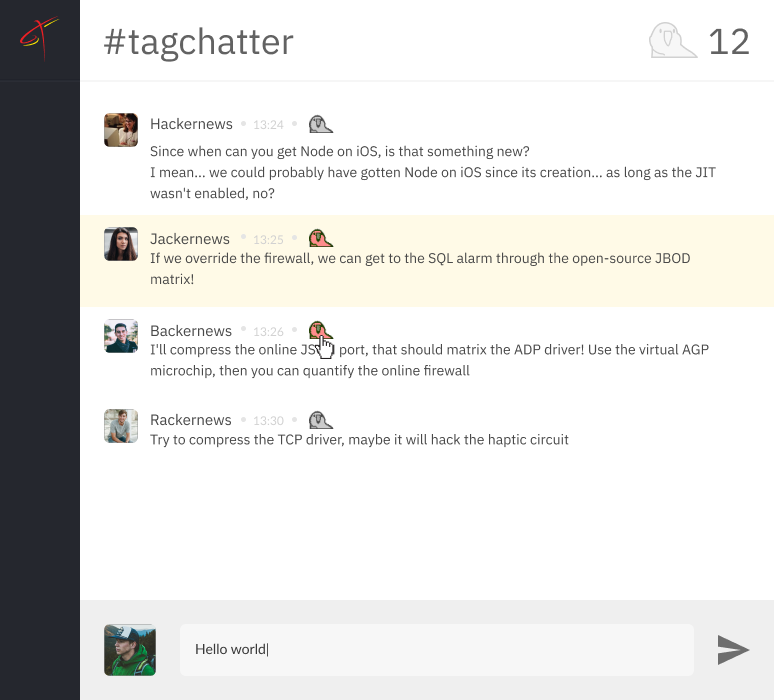

# TagChatter

Olá!

Estamos empolgados que você se interessou em fazer parte da equipe Tagview! Montamos um desafio baseado em alguns problemas semelhantes aos que resolvemos no nosso dia a dia para que possamos conhecer um pouco mais sobre você.

## Implementação
TagChatter é uma aplicação web onde os usuários conseguem conversar entre si e destacar mensagens.

Em [src](src) você encontra um esqueleto da aplicação com alguns exemplos, leia o código com atenção e implemente a sua solução à partir dele.

Os dados devem ser obtidos através da [API](#api) e você deve usar o [layout](#layout) como base no desenvolvimento.

### API
Desenvolvemos uma API REST que deve ser usada para obter os dados dos usuários e mensagens.

Você pode acessar as informações detalhadas e testar os endpoints acessando [tagchatter.herokuapp.com/docs](https://tagchatter.herokuapp.com/docs/)

### Layout
Você pode visualizar detalhes do layout [clicando aqui](https://www.figma.com/file/Zhyvatv2GVFm4UcKQlRE4Szs/tagchatter?node-id=0%3A1). Ao criar uma conta no Figma você conseguirá visualizar as medidas e baixar os ícones necessários.

### Requisitos técnicos
1. A lista de mensagens deve ser atualizada a cada 3 segundos
2. Ao clicar no ícone  deve-se:
  1. Fazer um request para `PUT /messages/:messageId/parrot`
  2. Destacar a mensagem na interface, seguindo o layout
  3. Incrementar o contador
3. Ao clicar no botão enviar, ao lado do campo de texto, deve-se fazer um request para `POST /messages` e adicionar a nova mensagem na lista exibida
4. O request para enviar mensagens (`POST /messages`) falha *intencionalmente* com uma probabilidade de 25%, retornando um erro 500. Idealmente a sua implementação deve tratar esses erros aleatórios, exibindo um `alert` e permitindo que o usuário tente enviar a mensagem novamente mas você pode desabilitar os erros passando o parâmetro `stable`. Consulte [a documentação da API](https://tagchatter.herokuapp.com/docs/#/message/post__messages) para mais detalhes.

### Requisitos adicionais
- Você pode continuar a implementação sem nenhum framework ou utilizar AngularJS, ReactJS ou VueJS
- *Os requests para a API devem ser feitos client-side*. **Não** queremos que você divida a sua aplicação em várias páginas, seguindo a estrutura Model View Controller.
- Você pode utilizar qualquer outra biblioteca adicional que achar necessário (jQuery, por exemplo)

## Submissão
Envie o URL de um repositório git público para `team@tagview.com.br`. Usamos bastante do [GitLab](https://gitlab.com) e o [GitHub](https://github.com).

## Boa sorte!
Nossa análise vai além do resultado final então se você tiver um problema implementando algum detalhe nos envie a sua solução mesmo assim.

### Critérios de avaliação
- Capacidade em assimilar um conteúdo novo
- Organização
- Atenção aos requisitos
- Empenho em entregar algo, mesmo que minimamente funcional
- Tratamento de erros

Caso tenha dúvidas, envie um e-mail para `team@tagview.com.br` :man_technologist:
