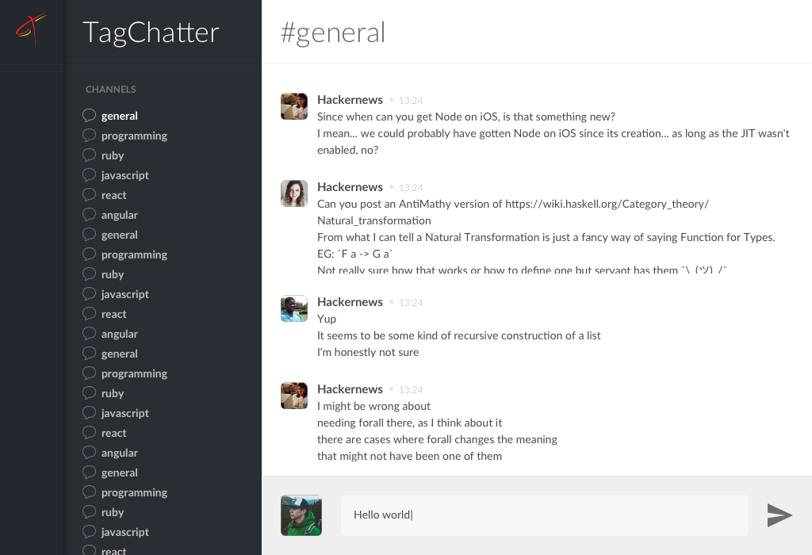

# TagChatter

Olá!

Estamos empolgados que você se interessou em fazer parte da equipe Tagview! Montamos um desafio baseado em alguns problemas semelhantes aos que resolvemos no nosso dia a dia para que possamos conhecer um pouco mais sobre você.

## Implementação

A ideia é que você desenvolva uma aplicação onde usuários conseguem conversar entre si através de channels (grupos). Os dados devem ser obtidos através da [API](#api) e a interface deve seguir o [layout proposto](#layout).

### Requisitos
- A lista de mensagens do channel que o usuário está visualizando deve ser atualizada a cada 3 segundos
- Ao acessar um channel o usuário deve visualizar a listagem atualizada de mensagens
- O request para enviar mensagens (`POST /channels/:channelId/messages`) falha *intencionalmente* com uma probabilidade de 25%, retornando um erro 500. Você pode desabilitar isso passando o parâmetro `stable` mas idealmente a sua implementação deve tratar esses erros aleatórios, permitindo que o usuário tente enviar a mensagem novamente. Consulte [a documentação da API](https://tagchatter.herokuapp.com/docs/#/channel/post_channels__channelId__messages) para mais detalhes.

### Linguagens aceitas
Você pode usar as bibliotecas e frameworks que preferir desde que a linguagem de programação esteja entre:

- Java
- Javascript
- Objective-C
- PHP
- Python
- Ruby
- Swift

### API
Desenvolvemos uma API REST que deve ser usada para obter os dados dos usuários, dos channels e enviar mensagens.

Você pode acessar as informações detalhadas e testar os endpoints acessando [tagchatter.herokuapp.com/docs](https://tagchatter.herokuapp.com/docs/)

### Layout
Os arquivos do layout estão na [pasta `layout`](layout). A fonte usada em todos componentes é a [Lato](https://fonts.google.com/specimen/Lato) e os ícones que você vai precisar estão em [assets](layout/assets).

## Submissão
Nos envie o URL de um repositório git público. Usamos bastante do [GitLab](https://gitlab.com) e o [GitHub](https://github.com).

:warning: **Não esqueça de adicionar as instruções de como executar o seu projeto**

## Boa Sorte!
Nossa análise vai além do resultado final então se você tiver um problema implementando algum detalhe nos envie a sua solução mesmo assim.

### Critérios de avaliação
- Capacidade em assimilar um conteúdo novo
- Fidelidade ao layout proposto
- Tratamento de erros
- Organização do repositório
- Atenção aos [requisitos](#requisitos)
- Empenho em entregar algo, mesmo que minimamente funcional

Caso tenha dúvidas, envie um e-mail para `team@tagview.com.br`